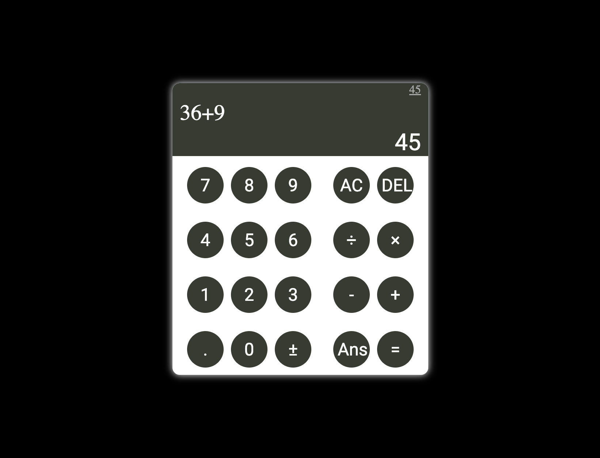

# Calculator

This is a simple calculator that can be used to perform basic arithmetic operations.

## Screenshot

## How to use

Click the link to open the
[Calculator](https://mosmn.github.io/Calculator/)

## Technologies used

- HTML
- CSS
- JavaScript
(no frameworks)

## Approach

I started by creating the basic HTML structure and then added the CSS to style the page using flexbox. I then wrote the basic arithmetic functions in JavaScript and added the event listeners to the buttons.

